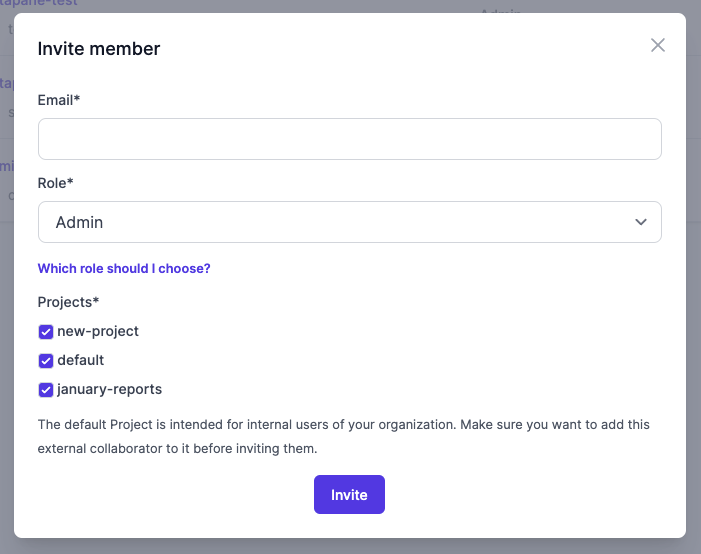

### Inviting members

You can invite members to your Workspace by going to the _Members_ tab in _Workspace settings_. Invited members will receive an email with a secure signup link valid for 72 hours.

{.docs-image}

### Roles and Projects

Every member must be assigned to one of our four system roles:&#x20;

1. **Viewer**: can view apps, but cannot run apps with functions.
2. **Editor**: all permissions of viewer, plus creating apps.
3. **Admin**: all permissions of editor, plus settings, member management and billing
4. **Analyst**: can run app functions, but can't create apps.

### Advanced

If you need to delete a member, click on the _Edit_ button next to the member's name. From here you can mark the member as not active. They will no longer be able to login, and will not be counted towards your member count for your next payment.
