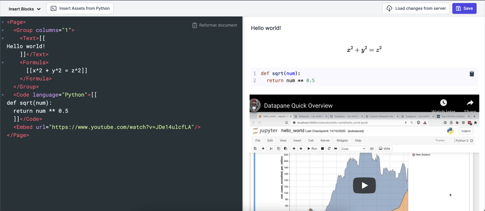

# Styling and Editing

!!! info

    You'll need to be logged into [Datapane.com](http://datapane.com) or your Teams instance to use this feature - it is not currently supported in the open-source version.

‌One of the challenges of building reports is the dependence on a Python environment. Datapane now allows you to create and edit reports directly on our server, meaning it's much easier to onboard non-technical users and make small changes to existing reports.

Our web editor can be used on any of your existing reports - just click 'Edit' and you'll see a side-by-side view with the left hand side showing the report XML structure, and the right hand side showing a report preview. You can then edit the XML to update the report.&#x20;



You can also create a report directly on Datapane.com by clicking the '[Create Report](https://datapane.com/report-from-template/)' button.&#x20;

## **Inserting blocks**

You can enrich your report by adding special blocks (click 'Insert Blocks'). For example, clicking on the Formula block will insert the following snippet into the web editor:

```xml
<Formula>[[x^2 + y^2 = z^2]]</Formula>
```

When you click 'Preview', you'll see this display as follows:&#x20;


You can edit the content inside the blocks to add additional parameters like `name,`as well as block-specific parameters. For example, here's a group with 2 columns:&#x20;

```xml
<Group columns="2", label="My_group">
      ...
</Group>
```

#### Empty block

If you need a placeholder for a chart that you'll upload from Python later, use the `empty` block. The editor will auto-generate a `name` which you can modify, and then push up assets to from Python (see next section).&#x20;

### Uploading Blocks from Python

Once you've created a report, you'll probably want to add some interactive plots and data from Python. You'll need the report`ID,` which you can find in the URL or in the editor bar by clicking `Insert Assets from Python`:&#x20;

.png>)

There are two ways to push up assets to an existing report from Python:&#x20;

#### **1. `report.upload`**

This does a full refresh of everything in your report, overwriting any changes you may have made in the web editor - here's an example:&#x20;

```python
import datapane as dp
import altair as alt
from vega_datasets import data

source = data.cars()

plot1 = alt.Chart(source).mark_circle(size=60).encode(
  x='Horsepower',
  y='Miles_per_Gallon',
  color='Origin',
  tooltip=['Name', 'Origin', 'Horsepower', 'Miles_per_Gallon']
).interactive()


report = dp.Report(
    dp.Text("## Simple Datapane Report with plot and table"),
    dp.Plot(plot1),
    dp.DataTable(source)
)

report.upload(id="XXXXXX")
```


Be careful when using this option as you will lose any changes you've made on the web editor.&#x20;


**2. `report.update_assets`**

This does a selective update of particular assets after you have already created a report. You'll need to give these assets a `name` and then pass them into a call to `report.update_assets` as follows:&#x20;

```python
import datapane as dp
import altair as alt
from vega_datasets import data

source = data.cars()

plot1 = alt.Chart(source).mark_circle(size=60).encode(
  x='Horsepower',
  y='Miles_per_Gallon',
  color='Origin',
  tooltip=['Name', 'Origin', 'Horsepower', 'Miles_per_Gallon']
).interactive()

report = dp.Report(
    dp.Text("## Simple Datapane Report with plot and table"),
    dp.Plot(plot1, name="plot1"),
    dp.DataTable(source, name="source_df")
)

# First report upload
report.upload(name="Hello world")

# Make some changes to the datatable and update it selectively
source=source[source.Origin=="USA"]
report.update_assets(source_df=source)
```

